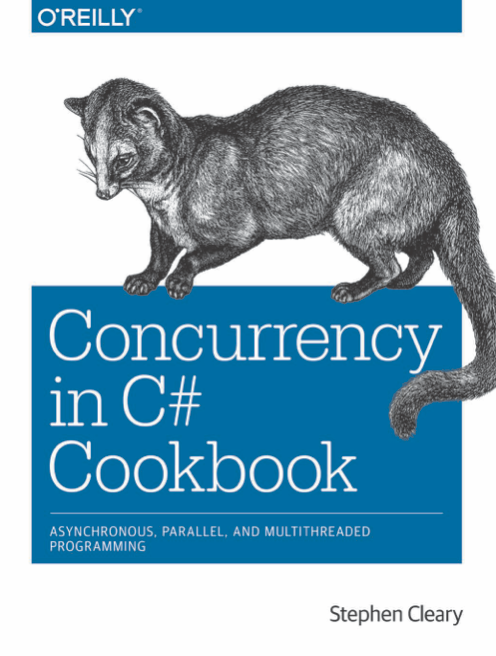

# Concurrency in C# Cookbook
В этом репозитории - мои заметки/конспекты по ходу чтения книги "Concurrency in C# Cookbook" by Stephen Cleary.

Книга написана во времена .NET 4.5 и C# 5.0.

  * [[DONE] Chapter 1. Concurrency: An Overview](./chapter01/README.md)
  * [[DONE] Chapter 2. Async Basics](./chapter02/README.md)
  * [[DONE] Chapter 3. Parallel Basics](./chapter03/README.md)
  * [[DONE] Chapter 4. Dataflow Basics](./chapter04/README.md)
  * [[DONE] Chapter 5. Rx Basics](./chapter05/README.md)
  * [[DONE] Chapter 6. Testing](./chapter06/README.md)
  * [[DONE] Chapter 7. Interop](./chapter07/README.md)
  * [DONE] Chapter 8. Collections
  * [DONE] Chapter 9. Cancellation
  * [DONE] Chapter 10. Functional-Friendly OOP
  * [DONE] Chapter 11. Synchronization
  * [DONE] Chapter 12. Scheduling
  * [DONE] Chapter 13. Scenarios

