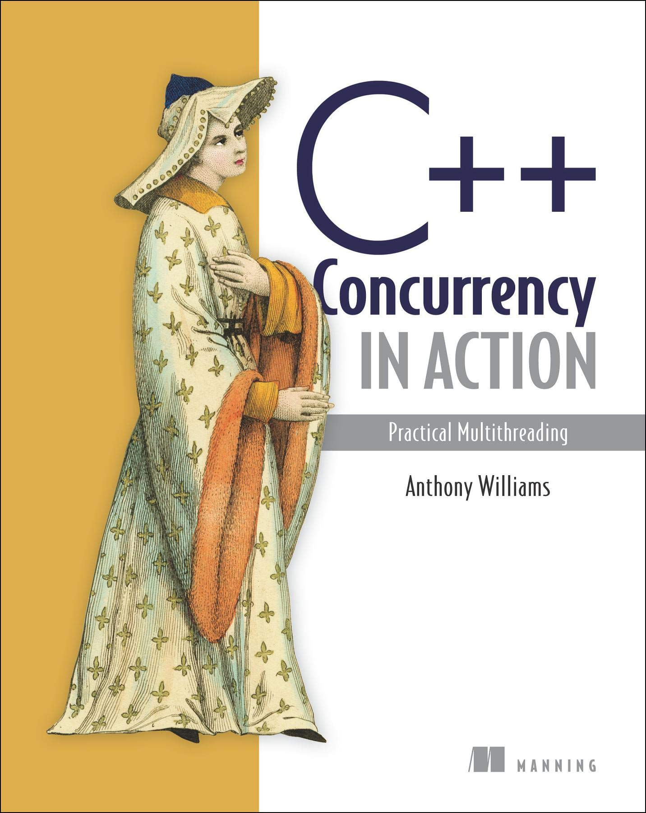

# C++ Concurrency in Action

[[DONE] Chapter 1. Hello, world of concurrency in C++!](./chapter01/README.md)

[[DONE] Chapter 2. Managing threads](./chapter02/README.md)

[[DONE] Chapter 3. Sharing data between threads](./chapter03/README.md)

[[DONE] Chapter 4. Synchronizing concurrent operations](./chapter04/README.md)

[[IN PROGRESS] Chapter 5. The C++ memory model and operations on atomic types](./chapter05/README.md)

[[OPEN] Chapter 6. Designing lock-based concurrent data structures](./chapter06/README.md)

[[OPEN] Chapter 7. Designing lock-free concurrent data structures](./chapter07/README.md)

[[OPEN] Chapter 8. Designing concurrent code](./chapter08/README.md)

[[OPEN] Chapter 9. Advanced thread management](./chapter09/README.md)

[[OPEN] Chapter 10. Testing and debugging multithreaded applications](./chapter10/README.md)

