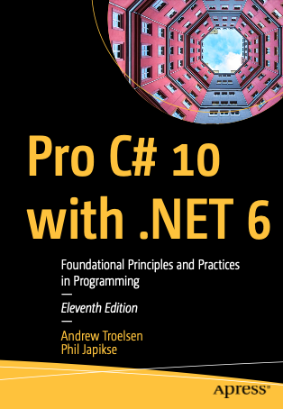

# C# 10 Troelsen
В этом репозитории - мои заметки/конспекты по ходу чтения книги Anrew Troelsen, Phil Japikse "Pro C# 10 with .NET 6".

## Part I: Introducing C# and .NET 6
  * [[DONE] Chapter 1. Introducing C# and .NET 6](./chapter01/README.md)
  * [[DONE] Chapter 2. Building C# Applications](./chapter02/README.md)

## Part II: Core C# Programming
  * [[IN PROGRESS] Chapter 3. Core C# Programming Constructs, Part 1](./chapter03/README.md)
  * [OPEN] Chapter 4. Core C# Programming Constructs, Part 2

## Part III: Object Oriented Programming with C#
  * [OPEN] Chapter 5. Understanding Encapsulation
  * [OPEN] Chapter 6. Understanding Inheritance and Polymorphysm
  * [OPEN] Chapter 7. Understanding Structured Exception Handling
  * [OPEN] Chapter 8. Working with Interfaces
  * [OPEN] Chapter 9. Understanding Object Lifetime

## Part IV: Advanced C# Programming
  * [OPEN] Chapter 10. Collections and Generics
  * [OPEN] Chapter 11. Advanced C# Language Features
  * [OPEN] Chapter 12. Delegates, Events, and Lambda Expressions
  * [OPEN] Chapter 13. LINQ to Objects
  * [OPEN] Chapter 14. Processess, AppDomains, and Load Contexts
  * [OPEN] Chapter 15. Multithreaded, Parallel, and Async Programming

## Part V: Programming with .NET Core Assemblies
  * [OPEN] Chapter 16.
  * [OPEN] Chapter 17.
  * [OPEN] Chapter 18.

## Part VI: File Handling, Object Serialization, and Data Access
  * [OPEN] Chapter 19.
  * [OPEN] Chapter 20.

## Part VII: Entity Framework Core
  * [OPEN] Chapter 21.
  * [OPEN] Chapter 22.
  * [OPEN] Chapter 23.
  * [OPEN] Chapter 24.

## Part VIII: Windows Client Development
  * [OPEN] Chapter 25.
  * [OPEN] Chapter 26.
  * [OPEN] Chapter 27.
  * [OPEN] Chapter 28.
  * [OPEN] Chapter 29.

## Part IX: ASP.NET Core
  * [OPEN] Chapter 30.
  * [OPEN] Chapter 31.
  * [OPEN] Chapter 32.
  * [OPEN] Chapter 33.
  * [OPEN] Chapter 34.
