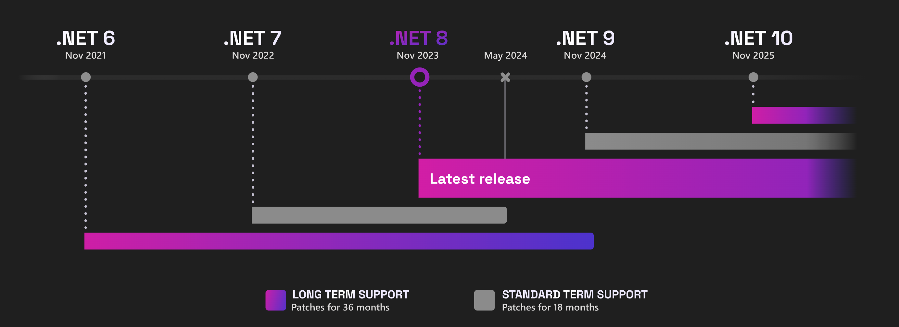
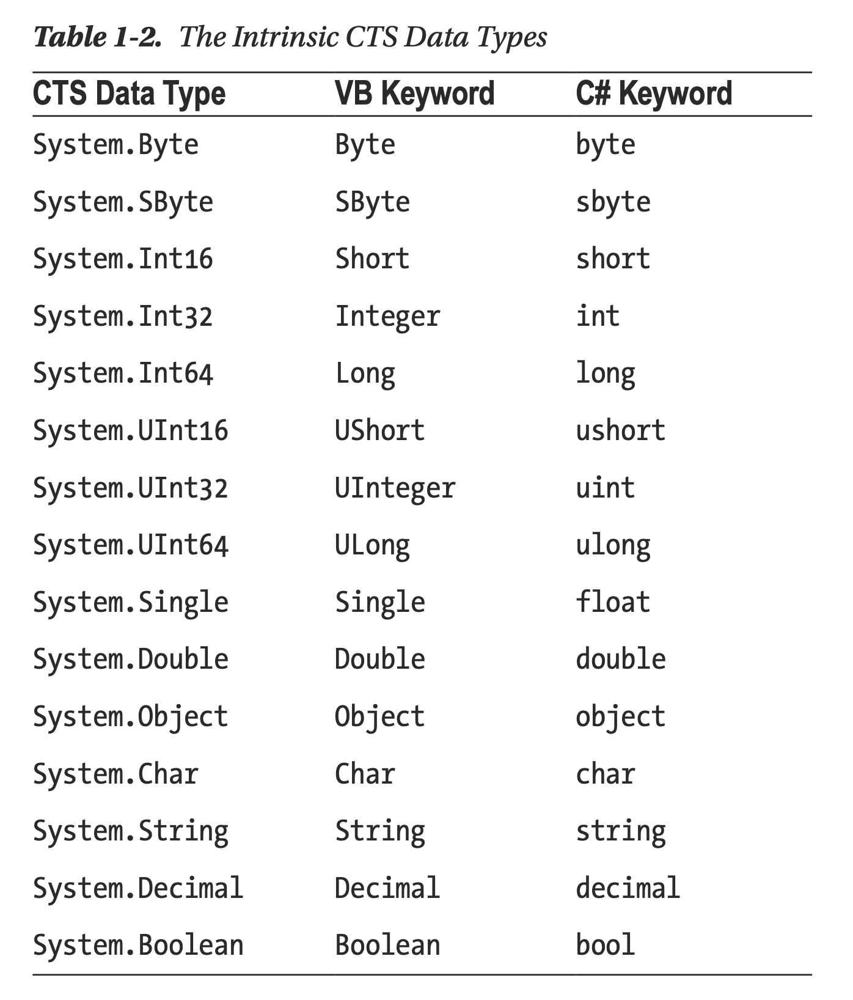
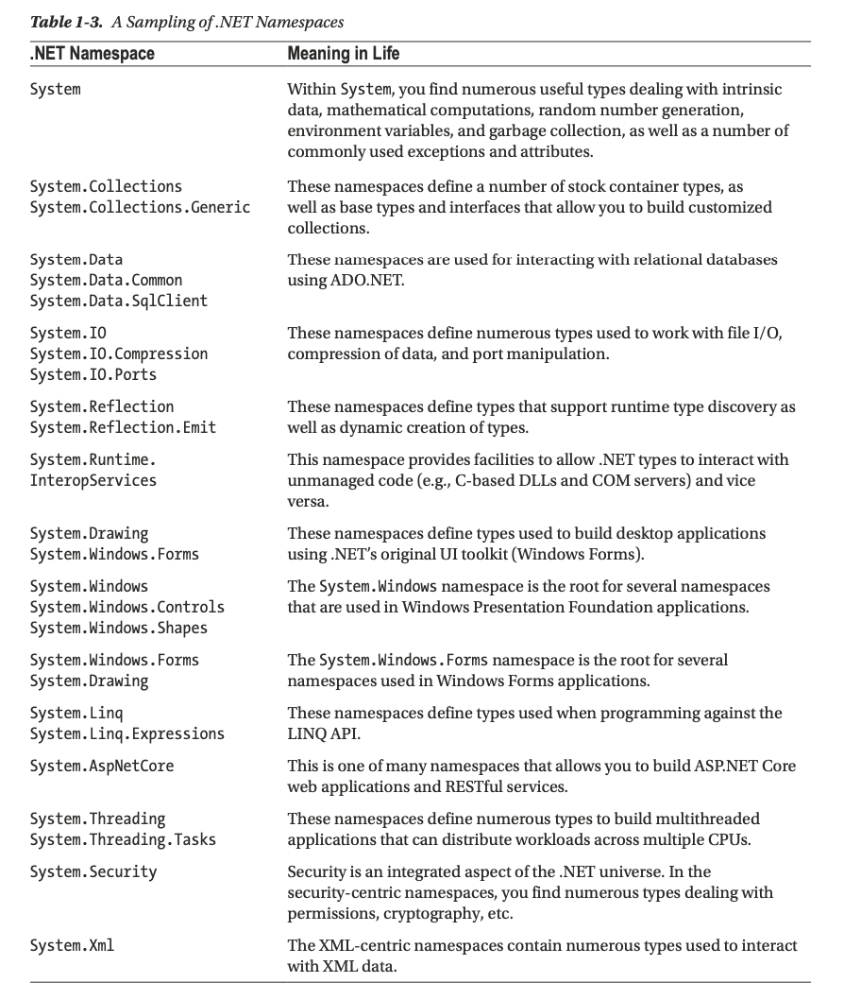

[<<<](../README.md)

# Chapter 1. Introducing C# and .NET 6
Очень сжатый таймлайн:
  * ~2002 - официально появилась информация о языке C# и платформе .NET
  * 2016 - Microsoft выпустила .NET Core
     С этого момента платформа не ограничена ОС Windows, но также может использоваться (для разработки и запуска) на iOS, Mac OS, Linux.
  * 2021.11.08 - выпущены C# 10 и .NET 6.
     Причём C# 10 работает с .NET версии 6 и выше.

## .NET Support Lifecycle
  * LTS (long-term support) releases - в течение 3 лет после релиза.
  * ST (short-term support aka Current) releases - в течение полугода.

.NET 6 - LTS release. Соответственно будет поддерживаться до ноября 2024 года.

Подробную информацию о поддержке разных версий платформы см. [здесь](https://dotnet.microsoft.com/en-us/platform/support/policy/dotnet-core).

По этой ссылке кстати немного другие обещания про саппорт:

## .NET Runtime, CTS, CLS
**.NET Runtime** - runtime environment и библиотека базовых классов. По сути это hardware/OS-specific часть.

**CTS** - Common Type System - спецификация всех возможных типов и конструкций, используемых рантаймом.

**CLS** - Common Language Specification - подмножество CTS, общее для всех .NET-языков.

Microsoft официально поддерживает языки: Visual Basic, C#, F#.

## .NET Standard
.NET standard регламентирует следующее:
  * Множество BCL (Base Class Library) APIs для всех реализаций .NET.
  * Форсит разработчиков выпускать библиотеки, которые работают с этими API, а значит портируемы между разными реализациями .NET.
  * Снижает (или даже исключает) условную компиляцию.

## What C# Brings to the Table
C# по своим синтаксическим конструкциям очень похож на Java. Но его нельзя называть клоном Java. Оба эти языка - из семейства C-языков (C, Objective-C, C++). И у всех этих языков схожий синтаксис.

Более того, многие синтаксические конструкции C# заимствованы у Visual Basic и C++. Есть также заимсвования из других языков, в т.ч. функциональных (e.g. LISP, Haskell).

## Managed vs. Unmanaged Code
> Officialy speaking, the term used to describe the code targeting the .NET runtime is **managed code**

> Conversely, code that cannot be directly hosted by the .NET runtime is termed **unmanaged code**.

## Getting an Overview of .NET Assemblies
Библиотеки .NET имеют то же расширение, что и нативные - `.dll`. Но имеют совсем другое содержимое - IL (Intermediate Language) и type metadata.

> **IL** is also known as MSIL (Microsoft Intermediate Language) aka CIL (Common Intermediate Language). Hence, these are synonyms. IL - это не машинный код, а байт-код. По аналогии с Java Byte Code.

Скомпилированные бинарники .NET называются **assembly** - как библиотеки, так и исполняемые файлы.

Assembly описывают с помощью метаданных, которые принято называть **manifest**>

## Compiling CIL to Platform-Specific Instructions
.NET assemblies содержат не машинный код, а байт-код (CIL). Поэтому при выполнении они на лету компилируются в машинный код с помощью JIT compiler (just-in-time compiler).

## Precompiling CIL to Platform-Specific Instructions
В .NET есть утилита `crossgen.exe`. Она позволяет заранее скомпилировать в конечный машинный код.

## Understanding the Common Type System
In the world of .NET, type is simply a general term used to refer to a member from the set `{class, interface, structure, enumeration, delegate}`.

## Exploring an Assembly Using ildasm.exe
The **Intermediate Language Disassembler utility** (ildasm.exe) allows you to create a text document representing a .NET assembly and investigate its contents, including the associated manifest, CIL code, and type metadata.
