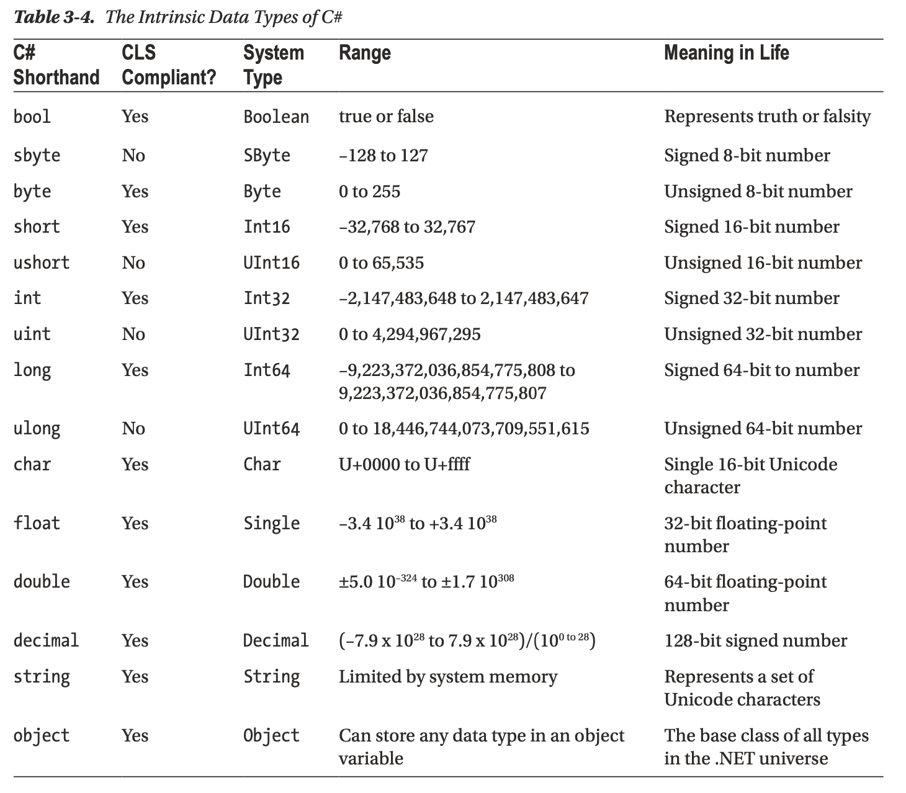
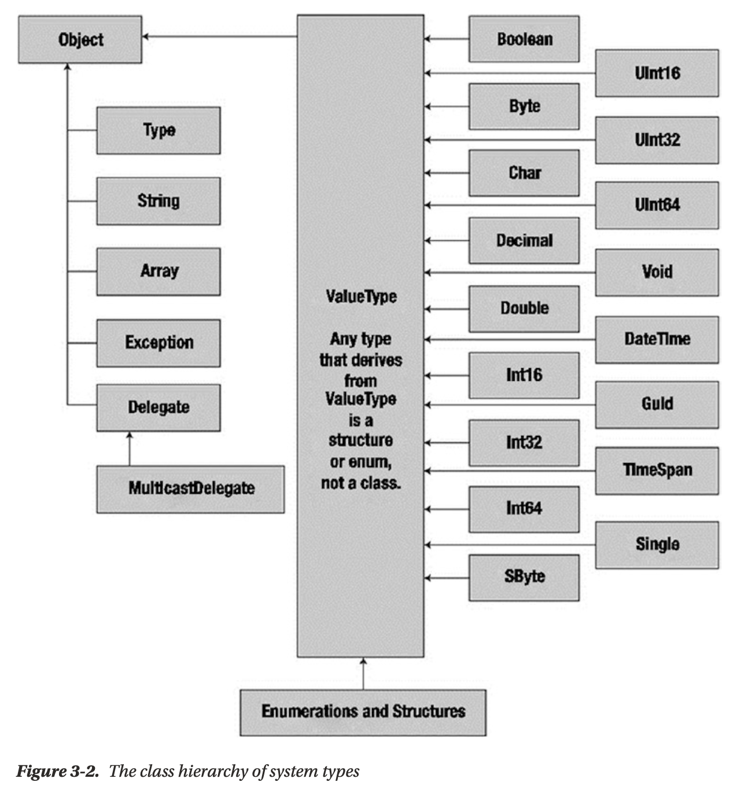
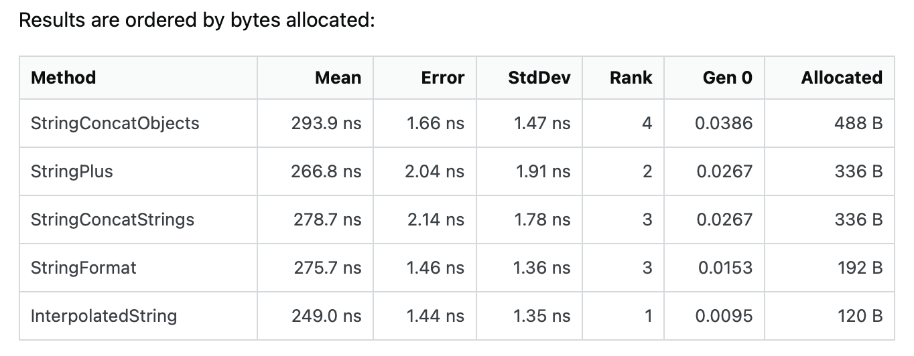

[<<<](../README.md)

# Chapter 3. Core C# Programming Constructs, Part 1

## Breaking Down a Simple C# Program (Updated C# 10)
At first, we create new solution:
```bash
dotnet new sln -n MySln -o my_sln
```

Create new project and add it to solution:
```bash
dotnet new console -lang c# -n SimpleCSharpApp -o ./my_sln/SimpleCSharpApp -f net6.0
dotnet sln ./my_sln add ./my_sln/SimpleCSharpApp
```

При этом внутри директории проекта будет создан файл `./my_sln/SimpleCSharpApp/Program.cs` со следующим содержимым:
```c#
// See https://aka.ms/new-console-template for more information
Console.WriteLine("Hello, World!");
```

Это упрощённый вариант бойлерплейта для нового приложения. Он стал доступен в более поздних версиях .net/c#. Рассмотрим более полную версию бойлерплейта:
```c#
class Program
{
    static void Main(string[] args)
    {
        // Display a simple message to the user.
        Console.WriteLine("***** My First C# App *****");
        Console.WriteLine("Hello, World!");
        Console.WriteLine();

        // Wait for Enter key to be pressed before shutting down.
        Console.ReadLine();
    }
}
```

Класс, содержащий, метод `Main()` можно называть как угодно. Но общепринято называть его `Program`. Этот класс также принято называть `application object`. В одном приложении может быть более одного `application object`. Это может быть полезно например для юнит-тестов. Но компилятор в таком случае должен знать, который из этих объектов главный. Это указывается в разделе `<StartupObject>` в файле проекта.


### Using Variations of the Main() Method (Updated 7.1)
По дефолту консольная утилита `dotnet` генерирует метод `Main()` такого вида:
```csharp
static void Main(string[] args)
{
    // ...
}
```

Также допустимы варианты:
```csharp
static int Main(string[] args)
{
    // ...
    return 0;
}

static void Main()
{
    // ...
}

static int Main()
{
    // ...
    return 0;
}
```

А начиная с C# 7.1 метод `Main()` может быть ещё и асинхронным:
```csharp
static Task Main()
static Task<int> Main()
static Task Main(string[])
static Task<int> Main(string[])
```


### Using Top-Level Statements (New 9.0)
Начиная с C# 9.0, допустимо опускать `application object` и метод `Main()` и писать команды прямо в корне файла. Но есть ограничения:
  * В проекте должен быть всего один файл, использующий top level statements.
  * Нельзя совмещать top level statements с явно задекларированной точкой входа.
  * Их нельзя включать в namespace.
  * и другие.


### Specifying an Application Error Code (Updated 9.0)
Тут всё ожидаемо.


### Processing Command-Line Arguments (Updated 9.0)
Тут тоже всё ожидаемо:
```csharp
static void Main(string[] args)
{
    for (int i = 0; i < args.Length; ++i)
    {
        Console.WriteLine("Arg: '{0}'", args[i]);
    }
}
```


## Additional Members of the System.Environment Class (Updated 10.0)
See example code [here](./my_sln/SystemEnvironmentClass/Program.cs).


## Using the System.Console Class
New example source code is here: [BasicConsoleIO](./my_sln/BasicConsoleIO/Program.cs)


## Working with System Data Types and Corresponding C# Keywords



### The default literal (New 7.1)
The `default` literal assigns a variable the default value for its data type. This works for standard data types as well as custom classes and generic types.
```csharp
int myInt = default;
MyClasss myClass = default;
```


### Using Intrinsic Data Types and the `new` Operator (Updated 9.0)
Все встроенные типы имеют `default constructor`. Это позволяет создать объект, инициализированный дефолтным значением с помощью оператора `new`:
```csharp
bool b = new bool();
int i = new int();
double d = new double();
DateTime dt = new DateTime();
```

В C# 9.0 был введён шорткат:
```csharp
bool b = new():
int i = new();
double d = new();
DateTime dt = new();
```


### Understanding the Data Type Class Hierarchy


Экземпляры всех типов, которые наследуют `System.ValueType` аллоцируются на стеке. Экземпляры типов, которые не наследуют `System.ValueType` аллоцируются в garbage-collected heap.


### Understanding the Members of Numerical Data Types
У встроенных типов есть всякие полезные свойства, через которые можно достать мета-информацию об этих типах, например:
```csharp
int.MaxValue
int.MinValue
double.MaxValue
double.MinValue
double.Epsilon
double.PositiveInfinity
double.NegativeInfinity
```


### Understanding the Members of System.Char
В C# строка и символ представлены типами `string` и `char` соответственно. Полное название типов - `System.String` и `System.Char`. Причём это unicode строка/символ.


### Parsing Values from String Data
У встроенных типов есть метод `Parse()`:
```csharp
bool b = bool.Parse("True");

if (bool.TryParse("True", out bool b))
{
    Console.WriteLine("Value of b: {0}", b);
}
```


### Using System.DateTime and System.TimeSpan (Updated 10.0)
`System.DateTime` - дата+время. `System.TimeSpan` - интервал времени.

```csharp
DateTime dt = new DateTime(2025, 04, 20);
Console.WriteLine("The day of {0} is {1}", dt.Date, dt.DayOfWeek);

TimeStan ts = new TimeSpan(4, 30, 0);
Console.WriteLine(ts.Subtract(new TimeSpan(0, 15, 0)));
```

There are also `System.DateOnly` and `System.TimeOnly` structs (since C# 10.0).


## Working with String Data

### Performing String Interpolation
You can format strings in C# as follows:
```csharp
string greeting = string.Format("Hello {0} you are {1} years old.", name, age);
```

But you can also use so called String Interpolation:
```csharp
string greeting = $"Hello {name} you are {age} years old.";
```


### Performance Improvements (Updated 10.0)
В C# версии 9 и ниже интерполяция строк при компиляции преобразовывалась в вызов `string.Format`. Начиная с C# версии 10 интерполяция строк обрабатывается при компиляции "по-умному". Это как правило приводит к коду в стиле `builder.Append()`.


### Working with Strings and Equality
Вообще, в C# при сравнении переменных ссылочного типа (reference types) сравниваются ссылки. Т.е. проверяется, что две переменные указывают на один и тот же объект.

`string` в C# - ссылочный тип. Однако сравнение для него переопределено: при сравнении строк, сравнивается их содержимое. Поэтому, можно писать так:
```csharp
string s1 = "qwerty";
string s2 = "asdf";
if (s1 == s2) // string values comparison!
{
    ...
}
```


### Strings Are Immutable
Строки в C# иммутабельны. Это значит, что при любых мутирующих операциях (включая присваивание) явно или неявно создаётся новая строка. Причём память под эту строку выделяется в хипе.

Важно учитывать эту особенность при использовании строк. Если нужно просто хранить значения - ОК. Если же нужно делать много операций, модифицирующих строки, следует рассмотреть другие варианты.


### Using the System.Text.StringBuilder Type
Одно из таких решений - использование класса `System.Text.StringBuilder`.

**N.B.** Интересно бы выяснить, что эффективнее: `System.Text.StringBuilder` или интерполяция строк. Погулил. Например, [вот в этой статье на StackOverflow](https://stackoverflow.com/questions/72926666/why-c-sharp-string-interpolation-slower-than-regular-string-concat) объясняется, что не всё так просто:
  * Реализация сильно зависит от версии дотнет. Чем новее, тем больше оптимизаций.
  * `+` не всегда работает за O(N^2). Компилятор может оптимизировать до O(N) если это явно цепочка последовательных вызовов. Это также значит, что не каждый конкат приводит к аллокации памяти.
  * С т.зр. потребления памяти от худшего подхода к лучшему порядок такой:
    * `String.Concat()` (the overloads accepting objects, not strings)
    * `+` + `String.Concat()` (the overloads accepting strings, not objects)
    * `string.Format()`
    * interpolated strings

Результаты бенчмарка из этой статьи:


Если увеличивать кол-во аргументов, разница в бенчмарках разных способов тоже увеличивается.


## Narrowing and Widening Data Type Conversions
Widening conversion делается неявно. Narrowing conversion - явно, иначе будет ошибка компиляции. Синтаксис конвертации - такой же как в языке Си:
```csharp
byte myByte = 0;
int myInt = 11;
myByte = (byte)myInt;
```

Осмысленность/корректность такой конвертации - на откуп разработчика.


### Using the checked Keyword

