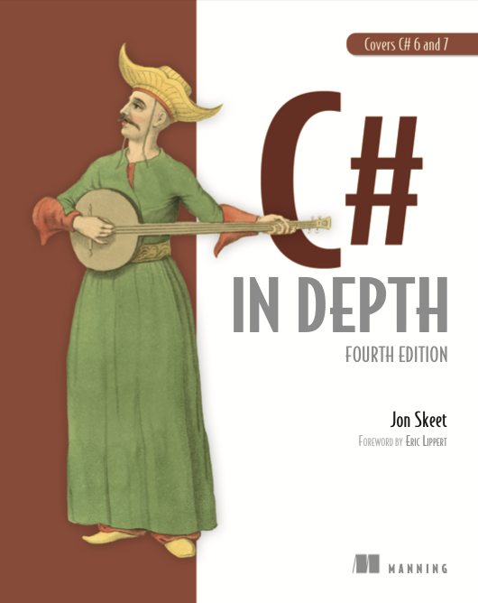

# C# in Depth
В этом репозитории - мои заметки/конспекты по ходу чтения книги "C# in Depth" by Jon Skeet.

## Part 1. C# in context
  * [[OPEN] Chapter 1. Survival of the sharpest](./chapter01/README.md)

## Part 2. C# 2-5
  * [OPEN] Chapter 2. C# 2
  * [OPEN] Chapter 3. C# 3: LINQ and everything that comes with it
  * [OPEN] Chapter 4. C# 4: Improving interoperability
  * [OPEN] Chapter 5. Writing asynchronous code
  * [OPEN] Chapter 6. Async implementation
  * [OPEN] Chapter 7. C# 5 bonus

## Part 3. C# 6
  * [OPEN] Chapter 8. Super-sleek properties and expression-bodied members
  * [OPEN] Chapter 9. Stringy features
  * [OPEN] Chapter 10. A smorgasbord of features for concise code

## Part 4. C# 7 and beyond
  * [OPEN] Chapter 11. Composition using tuples
  * [OPEN] Chapter 12. Deconstruction and pattern matching
  * [OPEN] Chapter 13. Improving efficiency with more pass by reference
  * [OPEN] Chapter 14. Concise code in C# 7
  * [OPEN] Chapter 15. C# 8 and beyond

