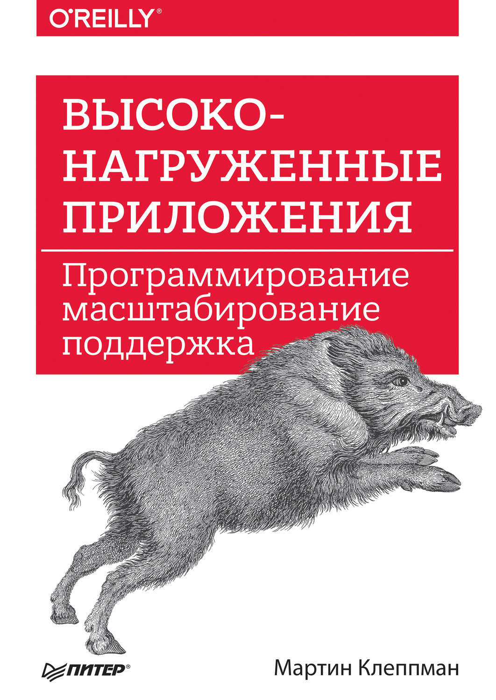
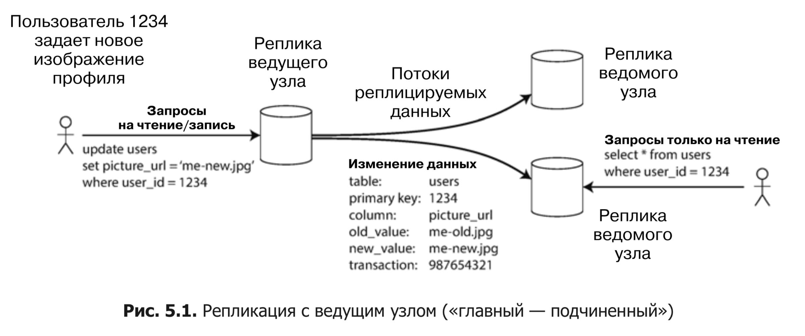
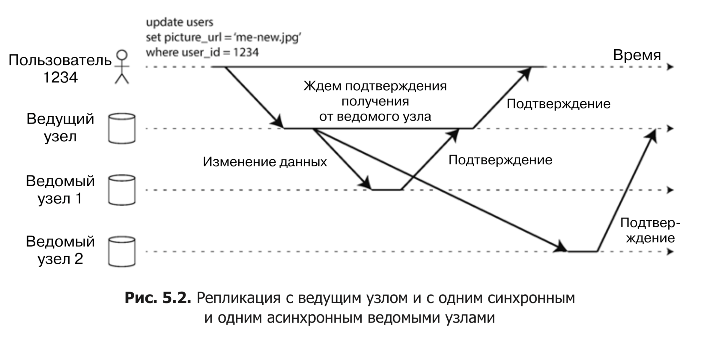

# designing_dia

Мои заметки по ходу чтения книги "Высоко-нагруженные приложения" Мартина Клеппмана.

## Часть I. Основы информационных систем

## Часть II. Распределенные данные
Существует множество поводов для распределения базы данных по нескольким машинам:
  * Масштабируемость.
  * Отказоустойчивость / высокая доступность.
  * Задержка (речь про снижение latency за счет географической распределенности реплик).

Существует два распространенных способа распределения данных по нескольким узлам:
  * Репликация.
  * Секционирование (шардирование).

### Глава 5. Репликация
В этой книге рассмотрено 3 популярных алгоритма репликации:
  * с одним ведущим узлом (single-leader)
  * с несколькими ведущими узлами (multi-leader)
  * без ведущего узла (leaderless)

Каждая операция записи в базу должна учитываться каждой репликой, иначе нельзя гарантировать, что реплики содержат одни и те же данные. Наиболее распространенное решение этой проблемы называентся репликацией с ведущим узлом (leader-based replication).

### Глава 6. Секционирование

### Глава 7. Транзакции

### Глава 8. Проблемы распределенных систем

### Глава 9. Согласованность и консенсус

## Часть III. Производные данные
