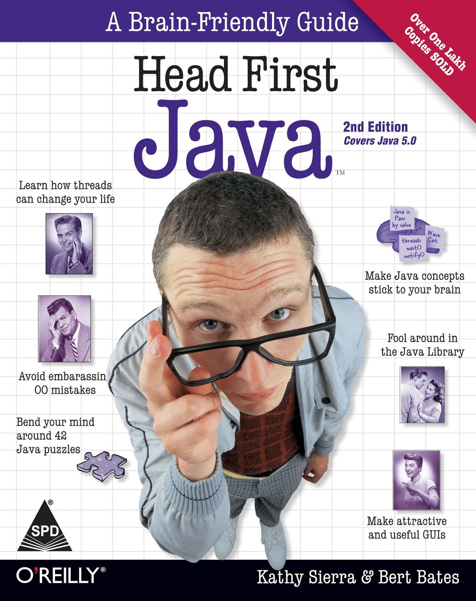
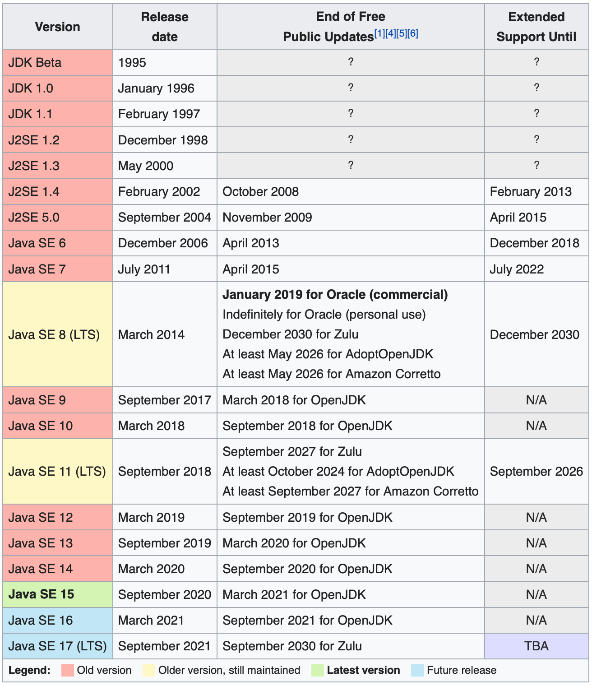

# head_first_java

Мои заметки по ходу чтения книги Сьерра, Бейтс, "Изучаем Java" (в оригинале "Head First Java").



## Введение
Книга (английская версия) вышла в 2009 году. Поэтому там рекомендуют скачать свежую версию JDK с сайта Sun :) С тех пор утекло много воды и Java теперь принадлежит Oracle. Так что, скачивать необходимо с сайта Oracle: https://www.oracle.com/ru/java/technologies/javase-downloads.html Документация там же. На момент чтения мной этой книги, самая свежая версия Java SE - 15.

Я же установил следующим образом:
```
> brew install oracle-jdk
...
> brew install oracle-jdk-javadoc
...
> javac --version
javac 15.0.1
```

## Глава 1. Погружаемся
Как скомпилировать и запустить программу на java:
```
> vim Party.java
...
> javac Party.java
> java Party
```

Эволюция версий Java:
```
Java:
1.02 (первый официальный релиз)
...
1.1

Java 2
1.2
1.3
1.4

Java 5 (aka Tiger aka Java 5.0 aka Java 1.5)
...

Java 15
```

В википедии есть [отдельная статья](https://en.wikipedia.org/wiki/Java_version_history), посвящённая истории версий Java. Скриншот:



На что стоит обратить внимание. В Яндекс.Диске и Яндекс.Телемосте используется 11ая версия. Что логично, т.к. это LTS версия.
