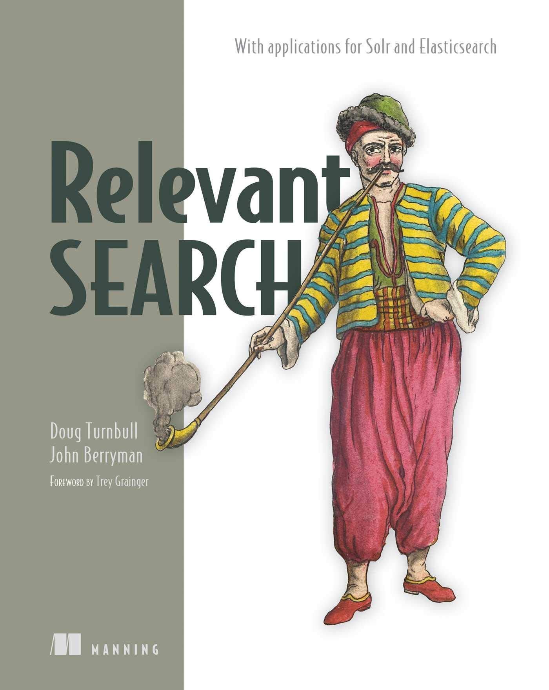

# relevant_search

Source code of book examples: https://github.com/o19s/relevant-search-book

[[DONE] Chapter 1. The search relevance problem](./chapter01/README.md)

[[DONE] Chapter 2. Search - under the hood](./chapter02/README.md)

[[DONE] Chapter 3. Debugging your first relevance problem](./chapter03/README.md)

[[DONE] Chapter 4. Taming tokens](./chapter04/README.md)

[[DONE] Chapter 5. Basic multifield search](./chapter05/README.md)

[[DONE] Chapter 6. Term-centric search](./chapter06/README.md)

[[DONE] Chapter 7. Shaping the relevance function](./chapter07/README.md)

[[DONE] Chapter 8. Providing relevance feedback](./chapter08/README.md)

[DONE] Chapter 9. Designing a relevance-focused search application

[DONE] Chapter 10. The relevance-centered enterprise

[DONE] Chapter 11. Semantic and personalized search

