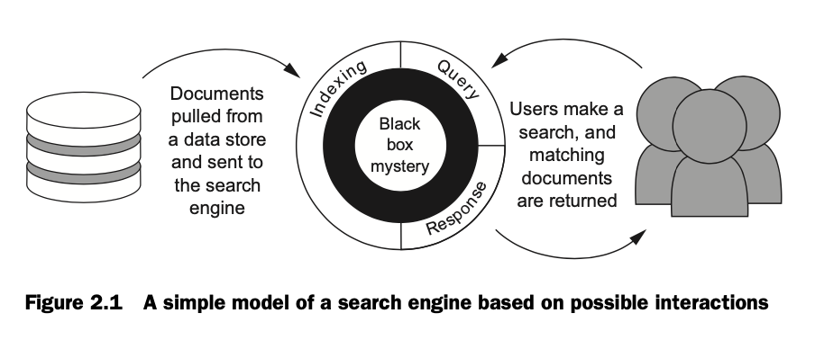
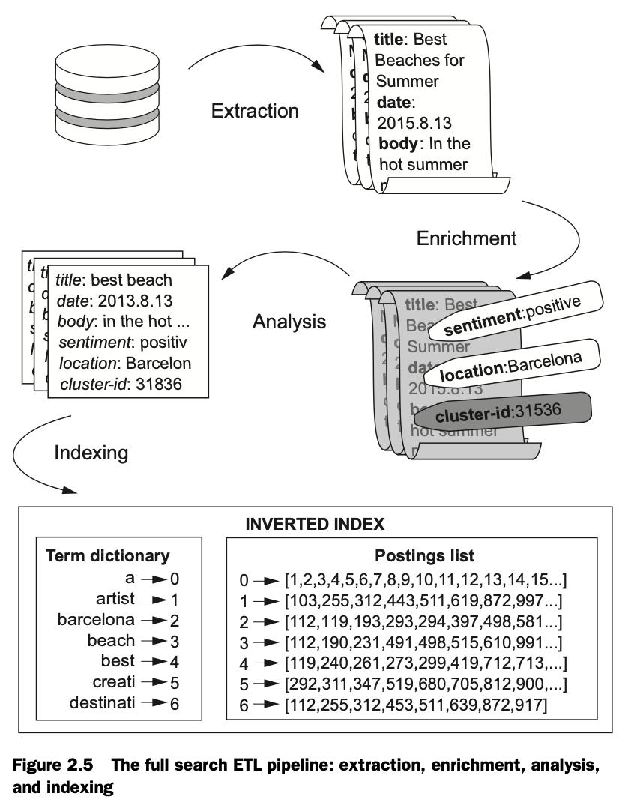
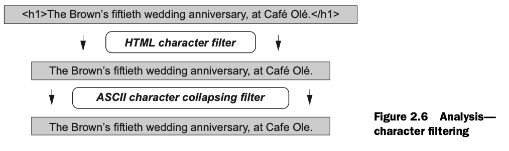
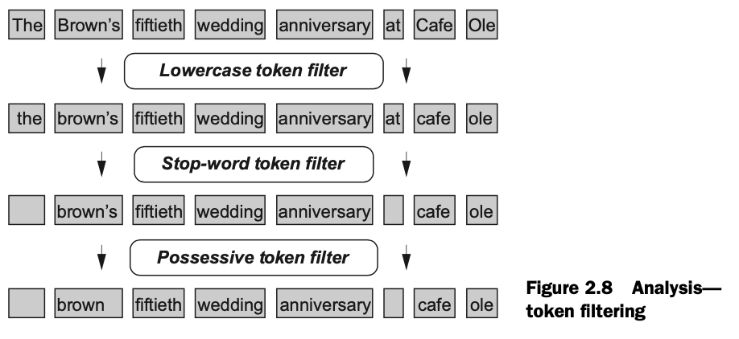

# Chapter 2. Search - under the hood

## 2.1. Search 101


```bash
SOURCE -> DOCUMENT -> TOKENIZED TEXT -> INDEXING DOCUMENTS
```

## 2.2. Search engine data structures
> At the core of a search engine is a data structure called the **inverted index**, analogous to the physical index at the back of this book. An inverted index is composed of two main pieces: a **term dictionary** and a **postings list**. The **term dictionary** is a sorted list of all terms that occur in a given field across a set of documents. For each term in the dictionary, there’s a corresponding list of documents that contain that term. This list of documents is referred to as the **postings** for a particular term.

So, inverted index basically constists of these are two mappings:
```bash
term dictionary:   term    -> term_id
postings list:     term_id -> [doc_id]
```

For example, if we have these documents:
```bash
0. One shoe, two shoe, the red shoe, the blue shoe.
1. The blue dress shoe is the best shoe.
2. The best dress is the one red dress.
```

the term dictionary looks as follows:
```bash
best  -> 0
blue  -> 1
dress -> 2
is    -> 3
one   -> 4
red   -> 5
shoe  -> 6
the   -> 7
two   -> 8
```

and the postings list is as follows:
```bash
0 -> [1,2]
1 -> [0,1]
2 -> [1,2]
3 -> [1,2]
4 -> [0,2]
5 -> [0,2]
6 -> [0,1]
7 -> [0,1,2]
8 -> [0]
```

### Important pieces of data associated with the inverted index
| Name | Description |
|-----|-----|
| **Doc frequency** | A count of documents that contain a particular term, or the length of the postings associated with a particular term. Doc frequency is useful in doc-ument scoring because it establishes a notion of importance for a particular term. For instance, the term “the” typically has a high document frequency, which indi-cates that it carries little discriminatory value when determining the relevancy of a document for a given search. |
| **Term frequency** | the number of times that a term occurs in a particular document. Term frequency is useful in document scoring because it establishes a notion of how important a document is for a given term. |
| **Term positions** | are a list of numbers indicating where a term occurs within a particular document. Word position is often important for search. Consider the semantic difference between a query for “dress AND shoes” and a query for “dress shoes.” Term positions make it possible to find documents based on phrase matches so that a search for “dress shoes” will give users exactly what they’re looking for. |
| **Term offsets** | One of the best ways to provide search users with feedback about why a particular document matches a query is to present them with highlighted snippets of the matching text. But reanalyzing the original text to extract highlights is often slow. The fastest way to highlight snippets is to keep track of the start and end character offsets of the terms when they’re first analyzed during indexing. Then, at search “time” all that needs to be done is to insert the appropriate tags at the corresponding offsets. |
| **Payloads** | Each term in the index can be associated with arbitrary data. One common example is to tag a token with its part of speech and use this in relevance scoring. Another common example is to associate an externally generated score with a token (this mention of “Barcelona” ought to be scored as 100, this other “Barcelona” mention a 59). |
| **Stored fields** | Information stored in an inverted index is useful for searching, but this information is a rather scrambled version of the original document. Any fields are to be presented back to the user or must be saved separately in stored fields. These stored fields can take up a lot of disk space. For this reason, many search developers avoid storing data directly in the search engine, instead retrieving display fields from the source system. |
| **Doc values** | It’s common to incorporate auxiliary values into the relevance-scoring heuristic. For instance, an e-commerce search might boost catalog items that are on clearance or that have a high profit margin. It’s also common to allow users to sort search results by a metric such as price or popularity. The doc values data structure allows for quick access to these auxiliary values and is useful when sorting, scoring, and grouping documents. |

## 2.3. Indexing content
Indexing content:
  * extraction
    <br>Extraction is the process of retrieving the documents from their sources.
  * enrichment
    <br>The optional step of enrichment adds information to the documents useful for relevance.
  * analysis
    <br>Analysis, as you saw earlier in this chapter, converts document text or data into tokens that enable matching.
  * indexing
    <br>And finally, indexing is the process of placing data into those data structures.

> When moving data into a data store, people talk about the process of extracting, transforming, and loading information, often referred to as **ETL**.



### Components of text analysis
  * character filtering
    <br>e.g. filter text in html document
    <br>
  * tokenization
    <br>i.e. roughly splitting text into words
    <br>
  * token filtering
    <br>i.e. lowercase token filter, stop-word token filter, posessive token filter
    <br>

## 2.4. Document search and retrieval

Lucene has a query type named ```BooleanQuery``` that’s used to achieve the behavior described previously. But the name is a bit misleading, and the behavior is not quite what you’d expect. You’d expect ```BooleanQuery``` to use the ```AND```, ```OR```, and ```NOT``` operators —- but it doesn’t! Instead, three clauses provide similar functionality, albeit with slightly different semantics: ```SHOULD```, ```MUST```, and ```MUST_NOT```.
  * A clause of type ```MUST``` has to have a match inside a document; otherwise, the document isn’t considered a match.
  * A clause of type ```SHOULD``` might or might not have a match in a given document, but documents that do have ```SHOULD``` clause matches are ranked higher than those that don’t.
  * Any document that contains a match for a ```MUST_NOT``` clause won’t be considered a match for the search results even if it does match a ```MUST``` or a ```SHOULD``` clause.

A ```BooleanQuery``` can have any number of ```SHOULD```, ```MUST```, and ```MUST_NOT``` clauses. But if a query doesn’t have a ```MUST``` clause, a document is considered a match only if one or more of the ```SHOULD``` clauses match.

In Lucene query syntax, the ```MUST``` and ```MUST_NOT``` queries are preceded by a prefix. The ```MUST``` clause is preceded by a ```+```, and the ```MUST_NOT``` clause is preceded by a ```-```. The ```SHOULD``` clause isn’t prefixed. Examples:
```bash
black +cat –dog
# It means: find all documents that:
#   * SHOULD contain "black" (if they do, rank em higher)
#   * MUST contain "cat"
#   * MUST_NOT contain "dog"

+(cat dog) black
# It means: find all documents that:
#   * MUST contain either "cat" or "dog" (because SHOULD used)
#   * MUST contain "black"
```
