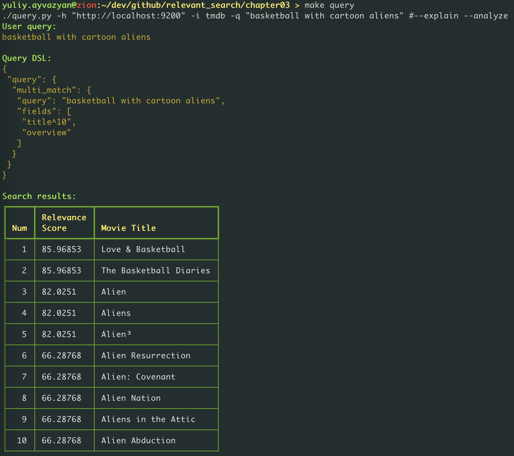
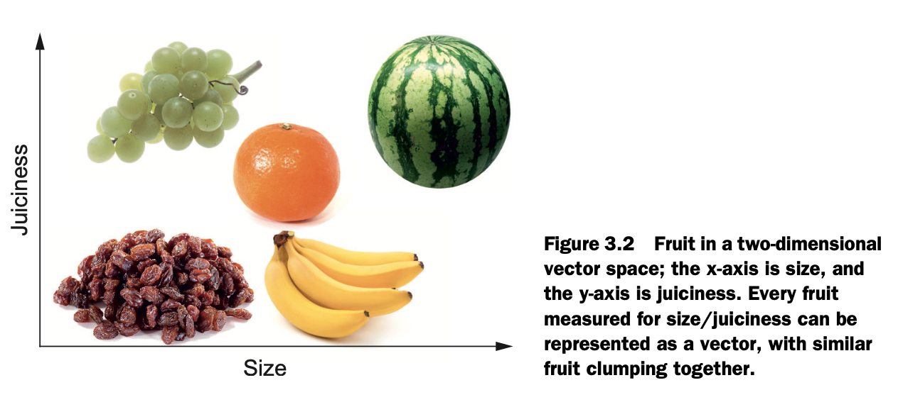

# Chapter 3. Debugging your first relevance problem

We need these 3 things to go on:
  * [x] search engine
  * [x] data set
  * [x] programming environment

Useful links:
  * [Source code examples for this book are stored on github](https://github.com/o19s/relevant-search-book)
  * Elastic search official web site: https://www.elastic.co
    * [docs](https://www.elastic.co/guide/index.html)


## How to run elasticsearch in docker?
There's a Makefile for simplicity. You can view the list of all commands via `make help` command:
```bash
 > make help
crawl                          Download fresh data via TMDB API
down                           Stop elasticsearch docker container
help                           Show this help.
index                          Index downloaded data
query                          Perform test search query
up                             Run elasticsearch in docker container
```

We're gonna use elasticsearch v7.17.7. It's not necessary to use this concrete version. But we're going to freeze the version for further reproducibility.

> **Warning!** Tag ```latest``` is not supported. You are to specify concrete tag. You can check a list of available tags on image page: https://hub.docker.com/_/elasticsearch

You can run elasticsearch this way:
```bash
make up
```

This command automatically downloads elasticsearch docker image from docker hub and runs it via docker-compose. You can stop the running service this way:
```bash
make down
```

Check whether it's up and running:
```bash
> docker ps -a
CONTAINER ID   IMAGE                  COMMAND                  CREATED              STATUS              PORTS                                            NAMES
e7f498be9de6   elasticsearch:7.17.7   "/bin/tini -- /usr/l…"   About a minute ago   Up About a minute   0.0.0.0:9200->9200/tcp, 0.0.0.0:9300->9300/tcp   elasticsearch

> curl localhost:9200
{
  "name" : "e7f498be9de6",
  "cluster_name" : "docker-cluster",
  "cluster_uuid" : "I2DeTtlOSCSJCVzJVcbVLQ",
  "version" : {
    "number" : "7.17.7",
    "build_flavor" : "default",
    "build_type" : "docker",
    "build_hash" : "78dcaaa8cee33438b91eca7f5c7f56a70fec9e80",
    "build_date" : "2022-10-17T15:29:54.167373105Z",
    "build_snapshot" : false,
    "lucene_version" : "8.11.1",
    "minimum_wire_compatibility_version" : "6.8.0",
    "minimum_index_compatibility_version" : "6.0.0-beta1"
  },
  "tagline" : "You Know, for Search"
}
```


## How to run elasticsearch on MacOS?
Install it via brew:
```bash
brew install elasticsearch
```

Run it:
```bash
elasticsearch
```

Check whether it's up and running:
```bash
curl localhost:9200
```

It should reply with something like that:
```json
{
  "name" : "07af942597fd",
  "cluster_name" : "docker-cluster",
  "cluster_uuid" : "9D1VHzWYQ_yww-zPsvGo1w",
  "version" : {
    "number" : "7.16.2",
    "build_flavor" : "default",
    "build_type" : "docker",
    "build_hash" : "2b937c44140b6559905130a8650c64dbd0879cfb",
    "build_date" : "2021-12-18T19:42:46.604893745Z",
    "build_snapshot" : false,
    "lucene_version" : "8.10.1",
    "minimum_wire_compatibility_version" : "6.8.0",
    "minimum_index_compatibility_version" : "6.0.0-beta1"
  },
  "tagline" : "You Know, for Search"
}
```


## TMDB (The Movie DataBase)
TMDB (The Movie DataBase) is a free service which stores information about lots of movies. It provides REST API.

I've registered the service. All credentials are stores in 1Password and Kaspersky Password Manager.

Useful links:
  * TMDB site: https://www.themoviedb.org
  * [API token is requested here](https://www.themoviedb.org/settings/api)
  * [API documentation](https://developers.themoviedb.org/3/getting-started/introduction)
  * [API wrappers & libraries](https://www.themoviedb.org/documentation/api/wrappers-libraries)

Some examples of using this API are given in book. I didn't like it )) Hence, created my own scripts:
  * [tmdb_crawler.py](/chapter03/tmdb_crawler.py)
    <br>Fetches movies data via TMDB API and stores in into file.
  * [tmdb_indexer.py](/chapter03/tmdb_indexer.py)
    <br>Loads movies data from file and inserts it into Elasticsearch.
  * [query.py](/chapter03/query.py)
    <br>Simple tool to send search queries to Elasticsearch.
  * [Makefile](/chapter03/Makefile)
    <br>See also Makefile that contains shortcuts to call these tools.

Before you begin the TMDB API access token should be stored into `TMDB_API_KEY` environment varible.

Finally I've created index as follows:
```bash
make crawl
make index
make query
```

### TMDB is blocked for users from Russia
> **!ACHTUNG!** Unfortunately TMDB has blocked itself for users from Russia.

I've googled that blocking is via DNS. Hence I tried this. I go to who.is and get one of IP addresses for api.themoviedb.org. Then I add these lines to my `/etc/hosts` file:
```bash
18.160.18.57 api.themoviedb.org
18.160.18.57 themoviedb.org
18.160.18.57 tmdb.org
```

It helped me to get access to the site. But further I got the following message:
```bash
Exception: API call failed! operation=tmdb:get_movie_list status=401 response={"status_code":7,"status_message":"Invalid API key: You must be granted a valid key.","success":false}
```

It looks like my API token is out of date or blocked. Probably it may be fixed if I somehow get access to TMDB website and update the token. But I decided to capitulate and use data downloaded earlier - movies_10000.tar.gz


## 3.4. Your first search application
The [query.py tool](/chapter03/query.py) is a simple tool to send search query to Elasticsearch. It takes user query, creates ```Query DSL``` and calls Elasticsearch ```_search``` API handle. Here's what I get after indexing 10K results from TMDB:




## 3.5. Debugging query matching
Added a corresponding flag to ```query.py``` tool:
```bash
 > ./query.py -h "http://localhost:9200" -i tmdb -q "basketball with cartoon aliens" --explain
User query:
basketball with cartoon aliens

Query DSL:
{
 "query": {
  "multi_match": {
   "query": "basketball with cartoon aliens",
   "fields": [
    "title^10",
    "overview"
   ]
  }
 }
}

Query DSL explain:
{
 "_shards": {
  "total": 1,
  "successful": 1,
  "failed": 0
 },
 "valid": true,
 "explanations": [
  {
   "index": "tmdb",
   "valid": true,
   "explanation": "((overview:basketball overview:with overview:cartoon overview:aliens) | (title:basketball title:with title:cartoon title:aliens)^10.0)"
  }
 ]
}

Search results:
┏━━━━━┳━━━━━━━━━━━┳━━━━━━━━━━━━━━━━━━━━━━━━━━━━━┓
┃     ┃ Relevance ┃                             ┃
┃ Num ┃ Score     ┃ Movie Title                 ┃
┡━━━━━╇━━━━━━━━━━━╇━━━━━━━━━━━━━━━━━━━━━━━━━━━━━┩
│   1 │ 101.46602 │ Aliens                      │
├─────┼───────────┼─────────────────────────────┤
│   2 │ 93.831116 │ Love & Basketball           │
├─────┼───────────┼─────────────────────────────┤
│   3 │ 84.85643  │ Cowboys & Aliens            │
├─────┼───────────┼─────────────────────────────┤
│   4 │ 80.63197  │ The Basketball Diaries      │
├─────┼───────────┼─────────────────────────────┤
│   5 │ 72.91974  │ Monsters vs Aliens          │
├─────┼───────────┼─────────────────────────────┤
│   6 │ 63.927162 │ Aliens in the Attic         │
├─────┼───────────┼─────────────────────────────┤
│   7 │ 63.927162 │ Aliens vs Predator: Requiem │
├─────┼───────────┼─────────────────────────────┤
│   8 │ 48.39403  │ Weathering with You         │
├─────┼───────────┼─────────────────────────────┤
│   9 │ 48.39403  │ Dances with Wolves          │
├─────┼───────────┼─────────────────────────────┤
│  10 │ 48.39403  │ Playdate With Destiny       │
└─────┴───────────┴─────────────────────────────┘
```

The query validation output is reminiscent of Lucene query syntax —- a low-level, precise way of specifying a search. In reality, the representation depends on each Lucene query’s Java ```toString``` method, which attempts (but doesn’t always accurately reflect) strict Lucene query syntax.

Что дальше с этим делать? Включить ```analyzer``` для конкретных полей. Делаю как в книге - не работает. Почитал доки, попробовал разные подходы. В итоге заработало, но не совсем как надо. В чем конкретно разница в моём решении с книжным:
  * Убрал `type` при вставке балка записей (см. функцию ```tmdb_indexer.py:insert_build()```).
  * Структура ```mappings``` из книжки даёт exception. Как указать маппинг для конкретного type - не понял, почему-то ничего не ищет. В итоге сделал, понял, что можно указать маппинг не для конкретного типа, а вообще. Так и сделал.
    ```json
    mapping_settings = {
      'properties': {
          #'movie': {
          #    'properties': {
                  'title': {
                      'type': 'text',
                      'analyzer': 'english',
                      #'analyzer': 'yy',
                  },
                  'overview': {
                      'type': 'text',
                      'analyzer': 'english',
                      #'analyzer': 'yy',
                  },
          #    }
          #},
      }
    }```
    <br>Если раскомментировать - будет по идее маппинг для типа ```movie```. В таком случае всё индексируется без ошибок. Но поиск не находит ничего тогда.
  * Убрал ```type``` в урле поискового запроса.

Ещё отличие! В книге написано, что analyze не покажет статистику по стоп-словам. У меня продолжает всё равно показывать. Но при этом explain дропает стоп-слова:
```bash
((overview:basketbal overview:cartoon overview:alien) | (title:basketbal title:cartoon title:alien)^10.0)
```

Ну ок, как-то работает. Причем! Теперь не только мусорные ответы со стоп-словами ушли, но также появились ответы с разными словоформами: alien, aliens, - т.к. анализатор ```english``` включает также стемминг для английского языка.

Теперь подробнее как выглядит выдача без анализатора и с ним. Без анализатора видим следующее:
```bash
┏━━━━━┳━━━━━━━━━━━┳━━━━━━━━━━━━━━━━━━━━━━━━━━━━━┓
┃     ┃ Relevance ┃                             ┃
┃ Num ┃ Score     ┃ Movie Title                 ┃
┡━━━━━╇━━━━━━━━━━━╇━━━━━━━━━━━━━━━━━━━━━━━━━━━━━┩
│   1 │ 101.46602 │ Aliens                      │
├─────┼───────────┼─────────────────────────────┤
│   2 │ 93.831116 │ Love & Basketball           │
├─────┼───────────┼─────────────────────────────┤
│   3 │ 84.85643  │ Cowboys & Aliens            │
├─────┼───────────┼─────────────────────────────┤
│   4 │ 80.63197  │ The Basketball Diaries      │
├─────┼───────────┼─────────────────────────────┤
│   5 │ 72.91974  │ Monsters vs Aliens          │
├─────┼───────────┼─────────────────────────────┤
│   6 │ 63.927162 │ Aliens in the Attic         │
├─────┼───────────┼─────────────────────────────┤
│   7 │ 63.927162 │ Aliens vs Predator: Requiem │
├─────┼───────────┼─────────────────────────────┤
│   8 │ 48.39403  │ Weathering with You         │
├─────┼───────────┼─────────────────────────────┤
│   9 │ 48.39403  │ Dances with Wolves          │
├─────┼───────────┼─────────────────────────────┤
│  10 │ 48.39403  │ Playdate With Destiny       │
└─────┴───────────┴─────────────────────────────┘
```

Теперь включаем english analyzer в коде индексатора следующим образом:
```python
        mapping_settings = {
            'properties': {
                #'movie': {
                #    'properties': {
                        'title': {
                            'type': 'text',
                            'analyzer': 'english',
                            #'analyzer': 'yy',
                        },
                        'overview': {
                            'type': 'text',
                            'analyzer': 'english',
                            #'analyzer': 'yy',
                        },
                #    }
                #},
            }
        }
```

Переиндексируем и теперь получаем выдачу:
```bash
┏━━━━━┳━━━━━━━━━━━┳━━━━━━━━━━━━━━━━━━━━━━━━┓
┃     ┃ Relevance ┃                        ┃
┃ Num ┃ Score     ┃ Movie Title            ┃
┡━━━━━╇━━━━━━━━━━━╇━━━━━━━━━━━━━━━━━━━━━━━━┩
│   1 │ 85.96853  │ Love & Basketball      │
├─────┼───────────┼────────────────────────┤
│   2 │ 85.96853  │ The Basketball Diaries │
├─────┼───────────┼────────────────────────┤
│   3 │ 82.0251   │ Alien                  │
├─────┼───────────┼────────────────────────┤
│   4 │ 82.0251   │ Aliens                 │
├─────┼───────────┼────────────────────────┤
│   5 │ 82.0251   │ Alien³                 │
├─────┼───────────┼────────────────────────┤
│   6 │ 66.28768  │ Alien Resurrection     │
├─────┼───────────┼────────────────────────┤
│   7 │ 66.28768  │ Alien: Covenant        │
├─────┼───────────┼────────────────────────┤
│   8 │ 66.28768  │ Alien Nation           │
├─────┼───────────┼────────────────────────┤
│   9 │ 66.28768  │ Aliens in the Attic    │
├─────┼───────────┼────────────────────────┤
│  10 │ 66.28768  │ Alien Abduction        │
└─────┴───────────┴────────────────────────┘
```

А теперь включаем свой кастомный analyzer вот таким образом:
```python
        analysis_settings = {
            'filter': {
                'english_stop': {
                    'type': 'stop',
                    'stopwords': '_english_',
                },
                'english_keywords': {
                    'type': 'keyword_marker',
                    'keywords': ['example'],
                },
                'english_stemmer': {
                    'type': 'stemmer',
                    'language': 'english',
                },
                'english_possessive_stemmer': {
                    'type': 'stemmer',
                    'language': 'possessive_english',
                }
            },
            'analyzer': {
                'yy': {
                    'tokenizer': 'standard',
                    'filter': [
                        'english_possessive_stemmer',
                        'lowercase',
                        'english_stop',
                        'english_keywords',
                        'english_stemmer',
                    ]
                }
            },
        }

	mapping_settings = {
            'properties': {
                #'movie': {
                #    'properties': {
                        'title': {
                            'type': 'text',
                            #'analyzer': 'english',
                            'analyzer': 'yy',
                        },
                        'overview': {
                            'type': 'text',
                            #'analyzer': 'english',
                            'analyzer': 'yy',
                        },
                #    }
                #},
            }
        }
```

Снова переиндексируем и смотрим, как поменялась выдача:
```bash
┏━━━━━┳━━━━━━━━━━━┳━━━━━━━━━━━━━━━━━━━━━━━━┓
┃     ┃ Relevance ┃                        ┃
┃ Num ┃ Score     ┃ Movie Title            ┃
┡━━━━━╇━━━━━━━━━━━╇━━━━━━━━━━━━━━━━━━━━━━━━┩
│   1 │ 85.96853  │ Love & Basketball      │
├─────┼───────────┼────────────────────────┤
│   2 │ 85.96853  │ The Basketball Diaries │
├─────┼───────────┼────────────────────────┤
│   3 │ 82.0251   │ Alien                  │
├─────┼───────────┼────────────────────────┤
│   4 │ 82.0251   │ Aliens                 │
├─────┼───────────┼────────────────────────┤
│   5 │ 82.0251   │ Alien³                 │
├─────┼───────────┼────────────────────────┤
│   6 │ 66.28768  │ Alien Resurrection     │
├─────┼───────────┼────────────────────────┤
│   7 │ 66.28768  │ Alien: Covenant        │
├─────┼───────────┼────────────────────────┤
│   8 │ 66.28768  │ Alien Nation           │
├─────┼───────────┼────────────────────────┤
│   9 │ 66.28768  │ Aliens in the Attic    │
├─────┼───────────┼────────────────────────┤
│  10 │ 66.28768  │ Alien Abduction        │
└─────┴───────────┴────────────────────────┘
```

В последнем что-то ни хрена не изменилось. Пока не разобрался, почему...


## 3.6. Debugging ranking
> The **score** is the number assigned by the search angine to a document matching a search. It indicates how relevant the document is to the search (higher score meanning more relevant). **Relevance ranking**, then, is typically a sort on this number.

Посмотрим снова на explain нашего запроса:
```bash
((title:basketbal title:cartoon title:alien)^10.0)
  |
(overview:basketbal overview:cartoon overview:alien)
```

Здесь символ ```|``` указывает поисковому движку выбрать матч с высшим скором.

Далее добавляем ```explain: True``` в Query DSL. Тогда explain будет выведен для каждого результата выдачи. См. [пример выхлопа тулзы query.py](/data/chapter03_explain_results.txt)


### 3.6.2. The vector-space model, the relevance explain, and you



В чём идея? Представляем каждое слово (каждый терм) - в виде вектора в многомерном пространстве. Например ```bag of words```:
  * Каждому слову в словаре соответствует измерение в нашем многомерном пространстве.
  * В самом простом варианте значение фичи (значение координаты в нашем многомерном пространстве) равно 1, если терм присутствует в документе/запросе; и 0 - в противном случае.

Далее если хотим посчитать score, делаем следующее:
  * Получаем вектор фичей для документа.
  * Получаем вектор фичей для запроса.
  * Скалярно перемножаем их.
  * Нормируем на длину вектора. Это чтобы получить значение скора от 0 до 1.

```bash
score =
  {  Vd[term1] * Vq[term1]
   + Vd[term2] * Vq[term2]
   + ...
   + Vd[termN] * Vq[termN]
  }
    /
  {
    ||Vd|| * ||Vq||
  }
```

Т.е. по сути - считаем косинусное расстояние.


### 3.6.5. Computing weights with TF x IDF
The rules for computing a term’s weight in a field is driven by what Lucene calls a ```similarity```. Most similarities are based on formula ```TF * IDF```, where:
  * TF = term frequency
    <br>If a matched term occurs frequently in a particular field in a document, we consider that field's text much more likely to be about that term.
  * IDF = 1/DF = inverse document frequency
    <br>Conversely, IDF tells us how rare (and therefore valuable) a matched term is.

Raw ```TF * IDF``` weighs a term’s importance in text by multiplying ```TF``` with ```IDF``` -— or put another way, ```TF * (1 / DF)```, or ```TF / DF```. This measures what proportion the index’s overall use of that term is concentrated in this specific document.


### 3.6.6. Lies, damned lies, and similarity
Подсчёт веса в лоб как ```TF * IDF``` обладает некоторыми недостатками:
  * Не учитывается разница в размере документов. Например, если терм встречается 1 раз в документе из одного предложения и из нескольких страниц, вес будет одинаковый. Хотя по смыслу это неверно.
  * Повторение слова в документе может сильно "забустить" вес. Например, в заголовке ```Fire with Fire```.
  * Подобные же проблемы с IDF.

Поэтому как правило вес вычисляется чуть иначе. Например:
```bash
(TF weighted) * (IDF weighted) * fieldNorm
```

Здесь:
  * ```TF weighted = sqrt(tf)```
  * ```IDF weighted = log(numDocs / (df + 1)) + 1```
  * ```fieldNorm = 1 / sqrt(fieldLength)```

> **Lucene’s next default similarity: BM25**
>
> Over the years, an alternate approach to computing a TF × IDF score has become prevalent in the information retrieval community: **Okapi BM25**. Because of its proven high performance on article-length text, Lucene’s BM25 similarity will be rolling out as the default similarity for Solr/Elasticsearch, even as you read this book.
>
> What is BM25? Instead of “fudge factors” as discussed previously, BM25 bases its TF × IDF “fudges” on more-robust information retrieval findings. This includes forcing the impact of TF to reach a saturation point. Instead of the impact of length (field- Norms) always increasing, its impact is computed relative to the average document length (above-average docs weighted down, below-average boosted). IDF is computed similarly to classic TF × IDF similarity.
>
> Will BM25 help your relevance? It’s not that simple. As we discussed in chapter 1, information retrieval focuses heavily on broad, incremental improvements to article- length pieces of text. BM25 may not matter for your specific definition of relevance. For this reason, we intentionally eschew the additional complexity of BM25 in this book. Lucene won’t be deprecating classic TF × IDF at all; instead, it will become known as the classic similarity. Don’t be shy about experimenting with both. As for this book’s examples, you can re-create the scoring in future Elasticsearch versions by changing the similarity back to the classic similarity. Finally, every lesson you learn from this book applies, regardless of whether you choose BM25 or classic TF × IDF.

See also: https://en.wikipedia.org/wiki/Okapi_BM25
