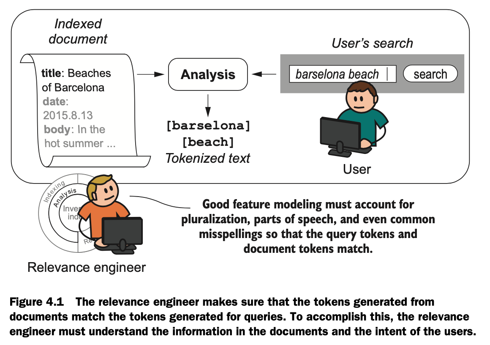
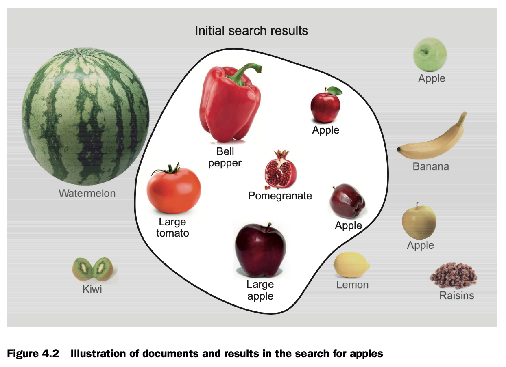
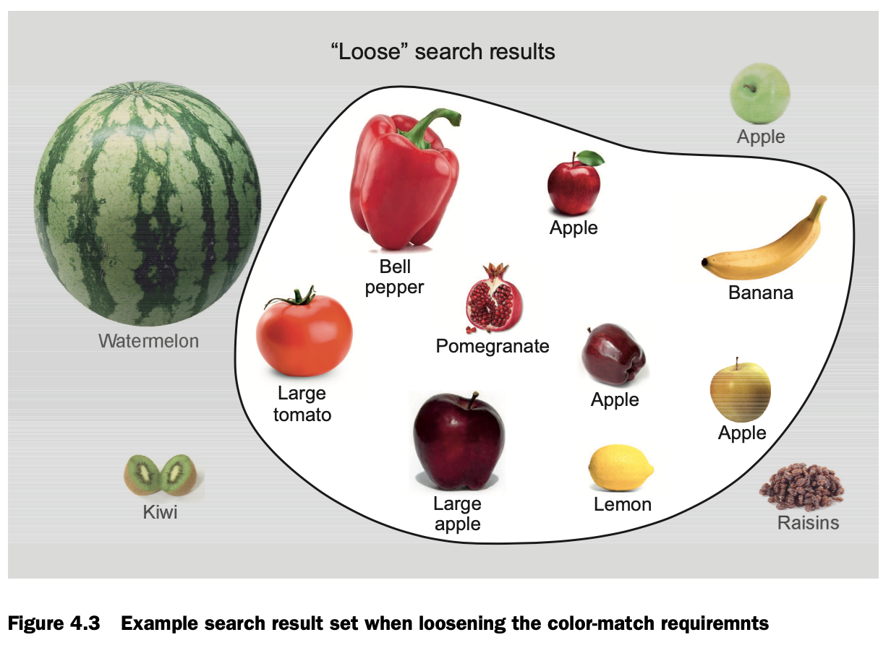
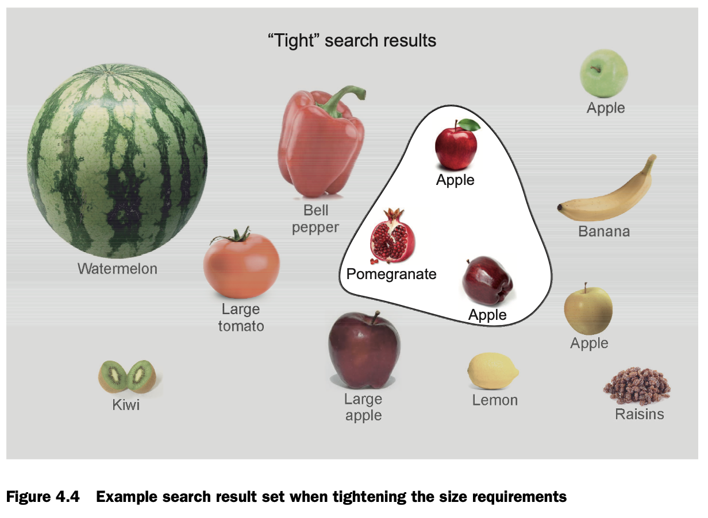

# Chapter 4. Taming tokens

## 4.1. Tokens as document features


> As you’ll soon see, meaningful tokens (features) can be extracted from things
> as diverse as geographic locations, images, and even whistled melodies.


## 4.2. Controlling precision and recall
> **Precision** —- The percentage of documents in the result set that are relevant.

> **Recall** —- The percentage of relevant documents that are returned in the result set.

Illustration of documents and results in the search for apples:


Here we have:
  * `precision = (3 / 6) * 100% = 50%`
  * `recall = (3 / 5) * 100% = 60%`

Example search result set when loosening the color-match requiremnts:


Example search result set when tightening the size requirements:


В этой главе предлагается пулять напрямую курлом запросы в elasticsearch. Курлом попробовал - не очень удобно. Поэтому решил оформлять запросы в стиле http-repr, т.е. файлики `*.http`. Их можно запускать например с помощью плагина `REST Client` в VSCode.

Для начала добавил команды для создания/удаления тестового индекса:
  * [create_index.http](./create_index.http)
  * [drop_index.http](./drop_index.http)

> Стоит обратить внимание, что в книге в списке фильтров есть `standard`. Я с таким фильтром получал `400 Bad Request` при попытке создать индекс. На [StackOverflow пишут](https://stackoverflow.com/questions/16928645/what-exactly-does-the-standard-tokenfilter-do-in-elasticsearch/16965481#16965481), что фильтр упразднён, т.к. с некоторой версии делал "ничего". Убрал его в своём запросе - всё зарпаботало.

Запрос `create_index.http` создает индекс с самым примитивным анализатором запросов в настройках. Запросом [analyze.http](./analyze.http) можно посмотреть, на какие термы разбивается запрос.

Далее в книге объясняется, как пересоздать анализатор для индекса. Приведенный запрос не работает - в моей версии эластика он просто невалиден. Я погуглил немного, быстро не нашел решение. Поэтому забил и просто сделал другой запрос - который создаёт индекс с нуля с нужными настройками. См. запрос [create_index__english_analyzer.http](./create_index__english_analyzer.http). 

Выдаёт вот такую ошибку:
```json
{
  "error": {
    "root_cause": [
      {
        "type": "access_control_exception",
        "reason": "access denied (\"java.io.FilePermission\" \"/tmp/keywords.txt\" \"read\")"
      }
    ],
    "type": "access_control_exception",
    "reason": "access denied (\"java.io.FilePermission\" \"/tmp/keywords.txt\" \"read\")"
  },
  "status": 500
}
```

В контейнере такого файла нет. Я убрал из запроса `english-keywords` - заработало!


## 4.3. Precision and recall -- have your cake and eat it too
С одной стороны есть трейдофф precision/recall. С другой - нас не интересуют ВСЕ релевантные результаты. Нам нужны топ-N. И это способ обойти трейдофф.

## 4.4. Analysis strategies
В это части главы приводятся конкретные примеры с использованием Elasticsearch, как можно улучшить precision/recall:
  * анализ акронимов
  * анализ телефонных номеров
  * анализ синонимов
  * ассиметричный анализ (т.е. при индексации при поисковом запросе используется разный анализ)
  * semantic expansion (например, подмешивание слов, расширяющих смысл, например если есть слово "собака", добавить слово "животное")
  * semantic specificity (это действие обратное "semantic expansion"; можно например фильтрацией по дереву категорий).

Об ассиметричном использовании semantic expansion:
  * If the tokens in the index represent a generalization of the tokens produced at query time, search will retrieve items that are more specific than the search term.
  * If the tokens produced at query time represent a generalization of the tokens in the index, search will retrieve items that are more general than the search term.

