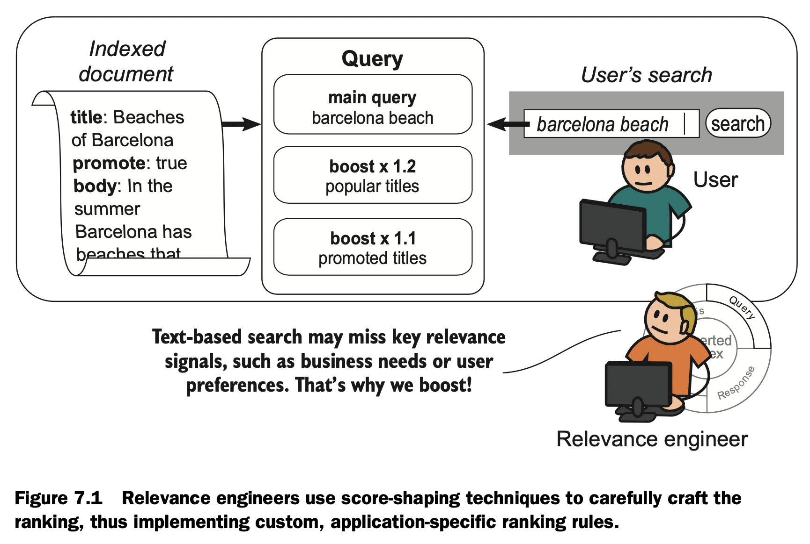

# Chapter 7. Shaping the relevance problem

## 7.1. What do we mean by score shaping?

**Boosting** — Given a base set of search results, boosting increases the relevance score of a subset of those search results.

**Filtering** — Given the entire corpus of possible search results, filtering removes a subset of those documents from consideration by specifying a filter query.

**Signals** — Signals measure important ranking criteria at search time. In this chapter, signals take a more quantitative tone: How recently was an article published? How close is the restaurant to me? The presence of a signal indicates when to filter or boost; the magnitude of the signal might control a boosting factor.

**Ranking function** — Filtering and boosting directly adjust the ranking function. For example, a boost might apply a multiplier proportional to how recently a movie was released. A filter might limit the subset of search results that the ranking function is run against.

## 7.2. Boosting: shaping by promoting results

## 7.3. Filtering: shaping by excluding results

## 7.4. Score-shaping strategies for satisfying business needs
