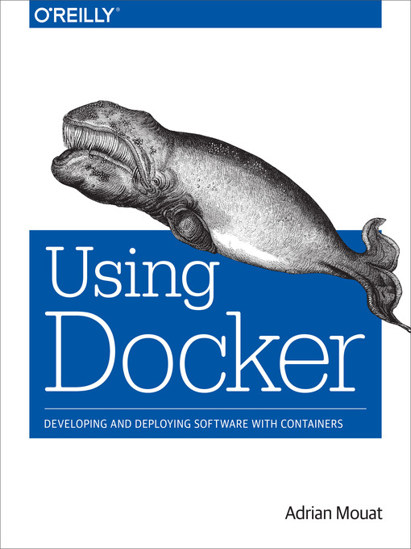

[Docker CookBook](./cookbook.md) - my personal docker cookbook

# using_docker
My notes about reading book "Using Docker" by Adrian Mouat

## Part I. Background and Basics
[Chapter 1. The What and Why of Containers](/chapter01.md)

[Chapter 2. Installation](/chapter02.md)

[Chapter 3. First Steps](/chapter03.md)

Chapter 4. Docker Fundamentals

## Part II. The Software Lifecycle with Docker

Chapter 5. Using Docker in Development

Chapter 6. Creating a Simple Web App

Chapter 7. Image Distribution

Chapter 8. Continuous Integration and Testing with Docker

Chapter 9. Deploying Containers

Chapter 10. Logging and Monitoring

## Part III. Tools and Techniques

Chapter 11. Networking and Service Discovery

Chapter 12. Orchestration, Clustering, and Management

Chapter 13. Security and Limiting Containers
