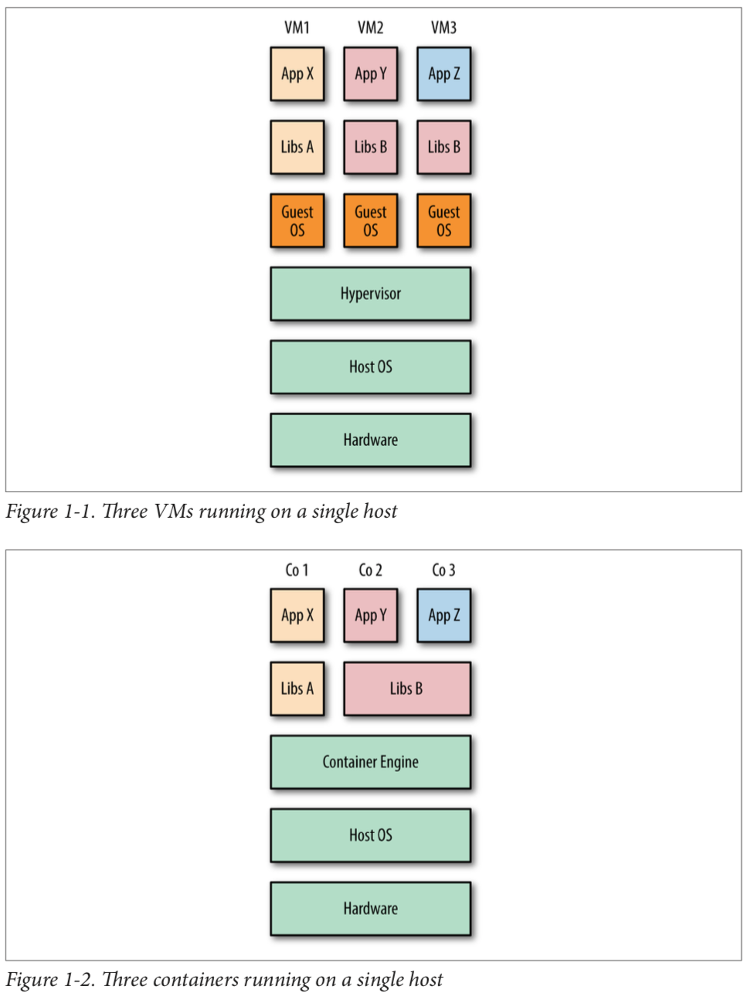

# Chapter 1. The What and Why of Containers

> **Containers** are an encapsulation of an application with its dependencies. At first glance, they appear to be just a lightweight form of virtual machines (VMs)—like a VM, a container holds an isolated instance of an operating system (OS), which we can use to run applications. 

> However, containers have several advantages that enable use cases that are difficult or impossible with traditional VMs:
>  * Containers share resources with the host OS, which makes them an order of magnitude more efficient. Containers can be started and stopped in a fraction of a second. Applications running in containers incur little to no overhead com‐ pared to applications running natively on the host OS.
>  * The portability of containers has the potential to eliminate a whole class of bugs caused by subtle changes in the running environment—it could even put an end to the age-old developer refrain of “but it works on my machine!”
>  * The lightweight nature of containers means developers can run dozens of con‐ tainers at the same time, making it possible to emulate a production-ready distributed system. Operations engineers can run many more containers on a single host machine than using VMs alone.
>  * Containers also have advantages for end users and developers outside of deploy‐ ing to the cloud. Users can download and run complex applications without needing to spend hours on configuration and installation issues or worrying about the changes required to their system. In turn, the developers of such appli‐ cations can avoid worrying about differences in user environments and the avail‐ ability of dependencies.

> More importantly, the fundamental goals of VMs and containers are different—the purpose of a VM is to fully emulate a foreign environment, while the purpose of a container is to make applications portable and self-contained.

There are 2 types of hypervisors:
  * **Type 1** - Run on bare metal. Example: Xen.
  * **Type 2** - Run on top of a host OS. Examples: VirtualBox, VMWare Workstation.

## Containers vs VMs

## Docker and Containers

> Containers are an old concept. For decades, UNIX systems have had the **chroot** command that provides a simple form of filesystem isolation. Since 1998, FreeBSD has had the **jail** utility, which extended chroot sandboxing to processes. Solaris Zones offered a comparatively complete containerization technology around 2001 but was limited to the Solaris OS. Also in 2001, Parrallels Inc, (then SWsoft) released the commercial **Virtuozzo** container technology for Linux and later open sourced the core technology as **OpenVZ** in 2005.3 Then Google started the development of **CGroups** for the Linux kernel and began moving its infrastructure to containers. The **Linux Containers (LXC)** project started in 2008 and brought together CGroups, kernel namespaces, and chroot technology (among others) to provide a complete containerization solution. Finally, in 2013, **Docker** brought the final pieces to the containerization puzzle, and the technology began to enter the mainstream.

> The Docker platform has two distinct components: the **Docker Engine**, which is responsible for creating and running containers; and the **Docker Hub**, a cloud service for distributing containers.
> The Docker platform has two distinct components: the Docker Engine, which is responsible for creating and running containers; and the Docker Hub, a cloud service for distributing containers.
